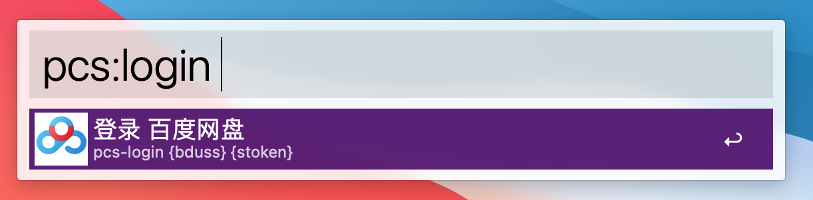
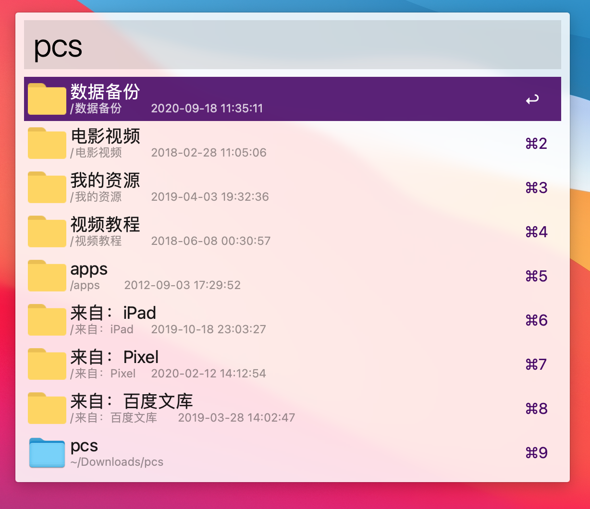
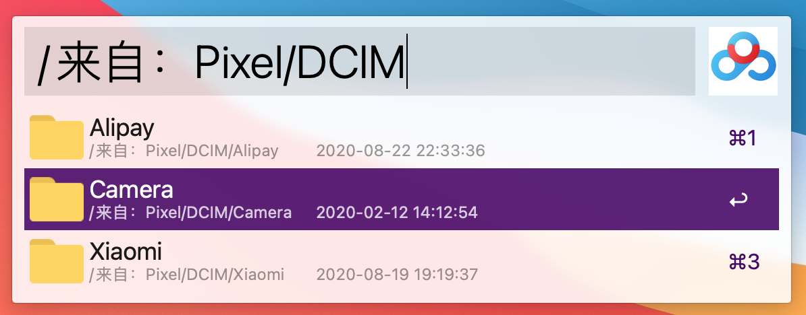
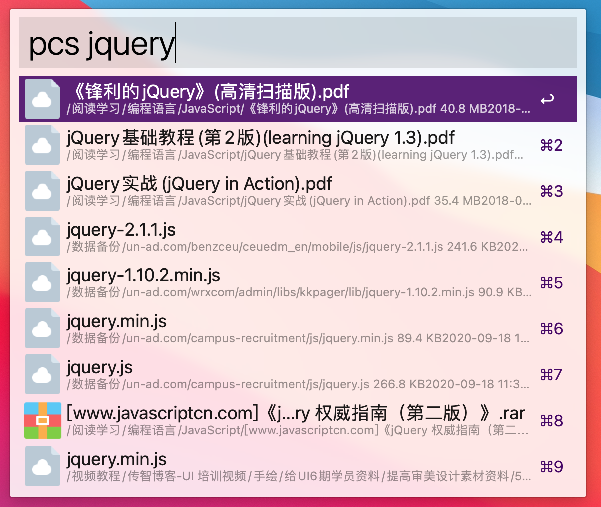
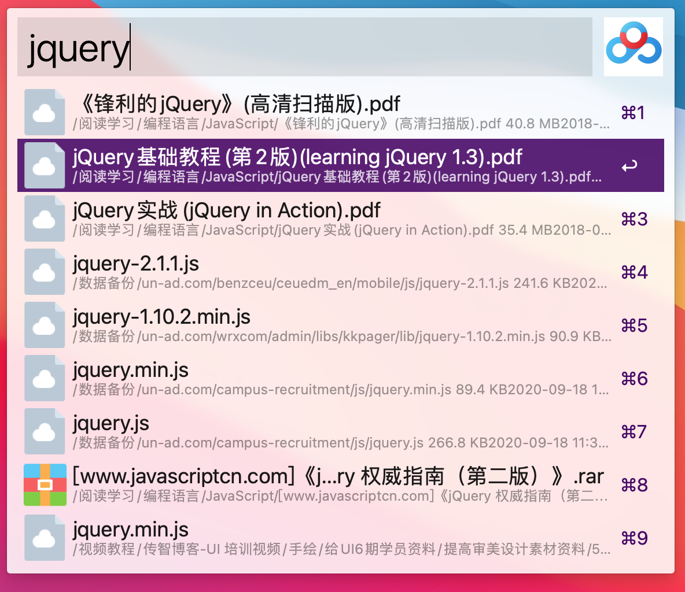

# pcs-alfred-workflow

百度网盘 Alfred workflow

## 安装

环境准备：`pip3 install BaiduPCS-Py`

下载 Workflow 并安装 [https://github.com/zacksleo/pcs-alfred-workflow/releases]

## 登录

1. 在网页版百度网盘登录成功后， 从 cookie 中分别 找到 BDUSS, STOKEN 做为以下输入

2. `pcs:login {bduss} {stoken}`

## 下载配置

如何使用下载功能, 安装成功后, 在对应的 Workflow Enviroment Variables 中, 配置以下环境变量:

| Name      | Value |
| --------- | ----- |
| browserId | -     |
| uk_unique | -     |

上面两个值可以在百度网盘网页中的 LocalStorage 中找到 (打开开发者工具, 依次找到Application-Storage-Local Storage)

## 浏览目录

`pcs`

## 搜索文件

`pcs {keyword}`

## 使用客户端下载

## 快捷键

1. 使用 Cmd, 在浏览器中打开
2. 使用 Alt(Option), 在上级目录中打开
3. 使用 Shift, 打开客户端
4. 使用 Ctrl, 使用客户端下载

## 参考

API参考 [[https://github.com/PeterDing/BaiduPCS-Py]]